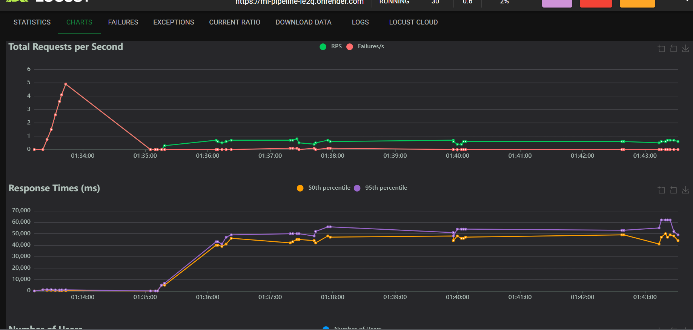
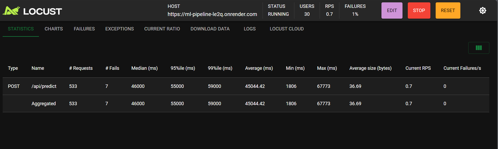

# Higher Education Student Performance Prediction System Pipe Line

## Overview
This project implements a machine learning pipeline for predicting student performance in higher education. The system uses historical student data to predict academic outcomes, helping educational institutions identify students who might need additional support or intervention.

## Report Submission

### 1. Feature Engineering Decisions
During the development process, we deliberately avoided creating additional feature columns due to the following considerations:
- New features introduced multicollinearity between existing features
- The addition of new features led to model performance degradation even using synthetic smoted data
- The original feature set provided sufficient predictive power without additional complexity
- Feature interactions were already captured in the base features

### 2. Data Preprocessing Limitations
The preprocessing phase faced certain limitations:
- Limited availability of external data for merging
- Data collection was region-specific, making cross-region merging potentially problematic
- Focus on maintaining data integrity and relevance to the specific use case
- Privacy concerns limited access to additional student information

### 3. Oversampling Technique Changes
The project underwent a significant change in the oversampling approach:
- Initially implemented ADASYN for handling class imbalance
- Switched to SMOTE due to the following error:
  ```
  "Error in preprocessing training data: Not any neighbours belong to the majority class. 
  This case will induce a NaN case with a division by zero. ADASYN is not suited for this 
  specific dataset. Use SMOTE instead."
  ```
- SMOTE provided more stable results and better handling of the minority class

### 4. Model Performance Observations
Important findings regarding synthetic data usage:
- When using SMOTE for training and validation splits, the classification metrics showed promising results
- However, performance degraded significantly when tested on real-world data
- This observation aligns with the known limitations of synthetic data in machine learning, where models may perform well on synthetic test sets but fail to generalize to real-world scenarios
- The gap between synthetic and real-world performance highlights the importance of proper validation strategies

## Features
- Data preprocessing and feature engineering pipeline
- Machine learning model training with class imbalance handling
- FastAPI-based REST API for predictions
- Interactive web interface for model predictions
- Comprehensive model evaluation metrics
- Docker containerization support


## Project Structure
```
.
├── app.py              # FastAPI application with API endpoints
├── pipeline.py         # ML pipeline implementation for training and prediction
├── generate_data.py    # Synthetic data generation for testing
├── models/            # Directory containing trained model artifacts
├── src/               # Source code modules
│   ├── preprocessing/  # Data preprocessing utilities
│   ├── training/      # Model training scripts
│   └── evaluation/    # Model evaluation metrics
├── notebook/          # Jupyter notebooks for analysis
├── data/              # Data storage directory
├── static/            # Static files for web interface
└── template/          # HTML templates for web pages
```

## Technical Stack
- **Backend Framework**: FastAPI
- **Machine Learning**: scikit-learn, TensorFlow
- **Data Processing**: pandas, numpy
- **Web Interface**: HTML, CSS, JavaScript
- **Containerization**: Docker
- **API Documentation**: OpenAPI (Swagger UI)

## Setup and Installation

### Prerequisites
- Python 3.8 or higher
- Docker (optional, for containerized deployment)
- Git

### Installation Steps

1. Clone the repository:
```bash
git clone https://github.com/eobolo/ml_pipeline.git
cd ml_pipeline
```

2. Create and activate a virtual environment:
```bash
python -m venv venv
# On Windows:
venv\Scripts\activate
# On Unix or MacOS:
source venv/bin/activate
```

3. Install dependencies:
```bash
pip install -r requirements.txt
```

4. Set up environment variables:
```bash
cp .env.example .env
# Edit .env with your configuration
```

### Running the Application

1. Start the FastAPI server:
```bash
uvicorn app:app --host 0.0.0.0 --port 8000
```

2. Access the following endpoints:
- API Documentation: `http://localhost:8000/docs`
- Web Interface: `http://localhost:8000`
- Health Check: `http://localhost:8000/health`

### Running with Docker
1. Build the Docker image:
```bash
docker build -t my-ml-app .
```

2. Run the container:
```bash
docker run -p 5000:5000 my-ml-app
```

The application will be available at `http://localhost:5000`

## Model Evaluation Metrics
- Accuracy
- Precision
- Recall
- F1-Score
- ROC-AUC
- Confusion Matrix

## Load Testing with Locust
I conducted load testing on my model's `/api/predict` endpoint using Locust to evaluate its performance under stress. The test simulated 30 concurrent users sending requests to a single Docker container deployment.

### Running Locust Tests
To run the load tests locally:
```bash
locust -f locust_latency.py --host=https://ml-pipeline-le2q.onrender.com
```

### Test Results and Analysis

#### Key Performance Metrics
- Total Requests: 169
- Failures: 4 (2.37% failure rate)
- Median Response Time: 44,000 ms (44 seconds)
- Average Response Time: 41,785 ms (42 seconds)
- Minimum Response Time: 1,806 ms (1.8 seconds)
- Maximum Response Time: 67,773 ms (68 seconds)
- Requests per Second (RPS): 0.4

#### Detailed Observations

##### Latency and Response Times

*Figure 1: Response time distribution and RPS over time*

##### Performance Metrics

*Figure 2: Detailed performance statistics from load testing*

- The median response time of 44 seconds indicates that half of all requests took at least this long to process
- While some requests were handled quickly (minimum 1.8 seconds), others experienced severe delays (up to 68 seconds)
- Response times remained consistently high throughout the test, with the 95th percentile fluctuating between 40-60 seconds
- The system struggled to maintain consistent throughput, averaging only 0.4 RPS
- Initial failure spike at test start, but stabilized later
- System showed signs of being overwhelmed with 30 concurrent users
- Response times remained high throughout the test duration

#### Conclusions
The single-container deployment showed significant performance limitations:
- High latency (44s median, 42s average) indicates processing bottlenecks
- Low throughput (0.4 RPS) suggests the container couldn't handle the load
- 2.37% failure rate indicates reliability issues, especially during initial load
- These results suggest the need for container scaling or performance optimization

## Acknowledgments
- Dataset source: [Higher Education Students Performance Evaluation](https://www.kaggle.com/datasets/csafrit2/higher-education-students-performance-evaluation?select=student_prediction.csv)
- Special thanks to [Your Acknowledgments]
